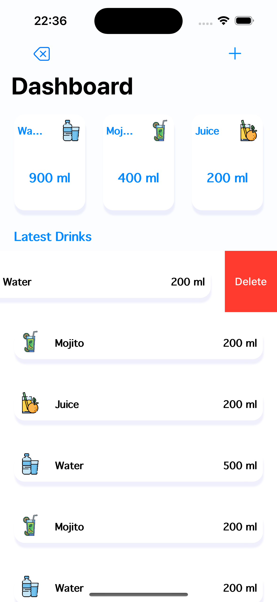
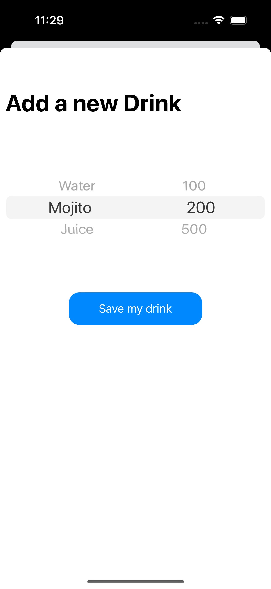

Please go under edit and edit this file as needed for your project.  There is no seperate documentation needed.

# Project Name - CheckMyLiquid
# Student Id - IT20659158
# Student Name - M.A.H.R.Nanayakkara

#### 01. Brief Description of Project - 
The Swift project is a versatile solution for managing drink inventory, ideal for juice bars or individuals tracking liquid consumption. Comprising three pages, it begins with a launch page, followed by a dashboard displaying total drink quantity added and a list of drinks. Users can swiftly add drinks through the dedicated page. Notably, the dashboard offers convenient deletion functionality through swipe gestures. This intuitive system ensures efficient monitoring of daily liquid usage, facilitating inventory management and consumption tracking with ease.

#### 02. Users of the System - 
1.⁠ ⁠Juice Bars: 
   - Owners and staff can utilize the system to manage inventory and track popular drinks.
   - Helps in maintaining stock levels and optimizing purchasing decisions.
   
2.⁠ ⁠Individuals: 
   - Health-conscious individuals can monitor their daily liquid intake.
   - Useful for those following specific dietary plans or hydration goals.
   
3.⁠ ⁠Small Cafes or Restaurants: 
   - Owners/operators can employ the system to keep track of beverage inventory and consumption trends.
   - Enables efficient management of drink offerings and reordering.
   
4.⁠ ⁠Event Planners: 
   - Useful for tracking beverage consumption at events, parties, or gatherings.
   - Helps in planning and budgeting for future events based on past consumption data.
   
5.⁠ ⁠Fitness Centers or Gyms: 
   - Facilities can monitor hydration options available to members.
   - Aids in ensuring a well-stocked inventory of beverages for post-workout refreshment.
   
6.⁠ ⁠Home Users: 
   - Individuals managing personal drink supplies at home can benefit from tracking their inventory and consumption habits.
   - Helps in avoiding overstocking or running out of favorite beverages.
   
   
#### 03. What is unique about your solution -
The solution is designed to accommodate the varying needs of different users, from small juice bars to larger cafes or even individuals managing their personal liquid inventory. Its scalability ensures it can handle growing inventory lists and evolving user requirements over time.

#### 04. Briefly document the functionality of the screens you have (Include screen shots of images)

01.Launch Screen - The launch screen acts as the first point of contact when the application is opened, displaying the app's logo and branding elements.
  

02.Dashboard Screen - The dashboard prominently displays the total amount of drinks added, providing users with a quick overview of their inventory.
Beneath the total quantity, the dashboard presents a list of drinks that have been added to the inventory, including their names and respective quantities.
Users can delete a drink from the list by swiping horizontally, offering a convenient and intuitive method for managing the inventory.
The dashboard updates in real-time as drinks are added or deleted, ensuring that users have access to the most up-to-date information about their inventory status.
 

03.Add Drink Screen - The screen includes input fields where users can enter the details of the drink they want to add, such as the drink's name and the quantity in milliliters (ml).
 


#### 05. Give examples of best practices used when writing code

01.Using Descriptive Variable Names: Descriptive names improve code readability and understanding.
```
var pickerData = [["Water","Mojito","Juice"],["100","200","500"]]

```

02.Avoiding Magic Numbers: Using constants or instead of magic numbers improves code readability and maintainability.
```
let cornerRadius: CGFloat = 15

```

03.Separating Concerns with Extensions: Extensions are used to separate functionality, making the code more organized and readable.
```

extension ViewController: UITableViewDelegate, UITableViewDataSource{
    
    func tableView(_ tableView: UITableView, numberOfRowsInSection section: Int) -> Int {
        return drinksArray.count
    }
    
    func tableView(_ tableView: UITableView, cellForRowAt indexPath: IndexPath) -> UITableViewCell {
        let cell: DrinksTableViewCell = tableView.dequeueReusableCell(withIdentifier: "cell", for: indexPath as IndexPath) as! DrinksTableViewCell
        
        let drink = drinksArray[indexPath.row]["drink"]
        let amount = drinksArray[indexPath.row]["amount"]
        
        cell.drink.text = drink
        cell.amount.text = "\(amount ?? "") ml"
        
        if drink == "Water" {
            cell.drinkImage.image  = UIImage(named: "water")
        }else if drink == "Mojito" {
            cell.drinkImage.image = UIImage(named: "mojito")
        }else if drink == "Juice" {
            cell.drinkImage.image = UIImage(named: "juice")
        }
        
        return cell
    }

extension ViewController {
    func getDrinks(){
        
        waterArray.removeAll()
        mojitoArray.removeAll()
        juiceArray.removeAll()
        
        for drink in drinksArray {
            let fluid = drink["drink"]
            let ml = drink["amount"]
            let intMl = Int(ml!)
            
            if fluid == "Water" {
                waterArray.append(intMl!)
            }else if fluid == "Mojito" {
                mojitoArray.append(intMl!)
            }else if fluid == "Juice" {
                juiceArray.append(intMl!)
            }
        }
    }

```

04.Using Swift Standard Library Functions: Using Swift's standard library functions improves code readability and performance.
```
waterLable.text = "\(String(waterArray.reduce(0, +))) ml"

```

05.Notifications for Data Refresh: Using NotificationCenter to post a notification when the data is updated (reloadTableData). This is a good practice to decouple components and notify interested parties about changes.
```
override func viewDidLoad() {
        super.viewDidLoad()
        // Do any additional setup after loading the view.
        tableView.delegate = self
        tableView.dataSource = self
        NotificationCenter.default.addObserver(self, selector: #selector(reloadData), name: NSNotification.Name(rawValue: "reloadTableData"), object: nil)

    }

```


#### 06. UI Components used

The following components were used in the CheckMyLiquid App, UIButton, UIAlert, UIViewController, UINavigationController, UITableView, UILabel, UIPickerView, UIImageView, UIView, UITableViewCell, UIAlertAction, UIAlertController.

#### 07. Testing carried out

```
import XCTest
@testable import CheckMyLiquid

class CheckMyLiquidTests: XCTestCase {

    var viewController: ViewController!
    var addDrinksViewController: AddDrinksViewController!

    override func setUp() {
        super.setUp()
        let storyboard = UIStoryboard(name: "Main", bundle: nil)
        viewController = storyboard.instantiateViewController(withIdentifier: "ViewController") as? ViewController
        addDrinksViewController = storyboard.instantiateViewController(withIdentifier: "AddDrinksViewController") as? AddDrinksViewController
        _ = viewController.view
        _ = addDrinksViewController.view
    }

    override func tearDown() {
        super.tearDown()
    }

    func testViewController() {
        // Test viewDidLoad
        XCTAssertNotNil(viewController.tableView.delegate)
        XCTAssertNotNil(viewController.tableView.dataSource)
        XCTAssertEqual(viewController.waterArray, [])
        XCTAssertEqual(viewController.mojitoArray, [])
        XCTAssertEqual(viewController.juiceArray, [])
        XCTAssertEqual(viewController.drinksArray, [])

        // Test viewWillAppear
        viewController.viewWillAppear(true)
        XCTAssertEqual(viewController.tableView.numberOfRows(inSection: 0), 0)
        XCTAssertEqual(viewController.waterLable.text, "0 ml")
        XCTAssertEqual(viewController.mojitoLable.text, "0 ml")
        XCTAssertEqual(viewController.juiceLable.text, "0 ml")

        // Test addDrinksButtonTapped
        let addButton = UIButton()
        viewController.addDrinksButtonTapped(addButton)
        XCTAssertEqual(viewController.drinksArray.count, 1)
        XCTAssertEqual(viewController.drinksArray[0]["drink"], "Water")
        XCTAssertEqual(viewController.drinksArray[0]["amount"], "100")

        // Test deleteAllDrinksTapped
        let deleteButton = UIButton()
        viewController.deleteAllDrinksTapped(deleteButton)
        XCTAssertEqual(viewController.drinksArray.count, 0)
    }

    func testAddDrinksViewController() {
        // Test viewDidLoad
        XCTAssertNotNil(addDrinksViewController.drinksPickerView.delegate)
        XCTAssertNotNil(addDrinksViewController.drinksPickerView.dataSource)

        // Test drinksButtonTapped
        addDrinksViewController.drinksButtonTapped(UIButton())
        let defaults = UserDefaults.standard
        let drinksArray = defaults.value(forKey: "MyDrinks") as? [[String: String]] ?? []
        XCTAssertEqual(drinksArray.count, 1)
        XCTAssertEqual(drinksArray[0]["drink"], "Water")
        XCTAssertEqual(drinksArray[0]["amount"], "100")
    }
}

```

#### 08. Documentation 

(a) Design Choices

01.Model-View-Controller (MVC) Architecture: MVC pattern by separating the data model (UserDefaults for storing drinks data), the view (storyboard elements like UILabel and UITableView), and the controller (ViewController and AddDrinksViewController) responsible for handling user interactions and updating the view.

02.User Interface: I have chosen simple and clean user interface design, using labels for displaying drink types and amounts, along with corresponding images.

03.Data Storage: Using UserDefaults for storing drink data allows for simple data persistence without the need for a database.

04.Notification Center: Using NotificationCenter for reloading table data ensures that the table view updates whenever new drink data is added.

05.Custom Views: The use of custom views for buttons and table view cells adds a consistent visual style to your app.


(b) Implementation Decisions

01.TableView: Using a UITableView to display drink data allows for easy navigation and scrolling through the list of drinks.

02.PickerView: Using a UIPickerView for selecting drink types and amounts simplifies the process of adding new drinks.

03.Custom Cells: Customizing table view cells with shadows and rounded corners enhances the visual appeal of the app.

04.Data Handling: Separating the logic for calculating total amounts of each drink type into a separate function keeps the code organized and maintainable.


(c) Challenges

1.⁠ ⁠Implementing the user friendly "add new drink " screen. It is one screen swaping input screen and user can easily select the drink. 

2.⁠ ⁠Implementing real time  data syncing without refreshing

#### 09. Reflection

Time management and adding new features to the system through researching

  

